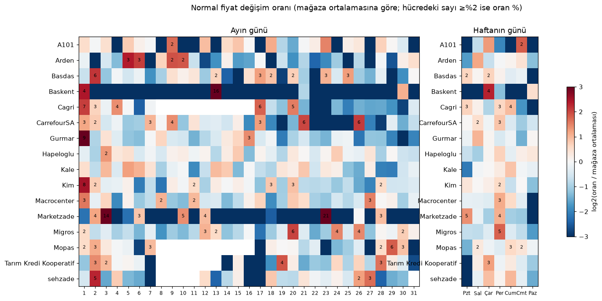

# Hedef gün seçimi — rapor (tüm mağazalar)

Görev tanımı: [handoff_target_days.md](handoff_target_days.md). Veri: upstream repo, 6 Ekim 2026 itibarıyla (commit `c2bb62e`).

## Kısa cevap

1. **Takvim kapısı gerekli, ama sebebi pilotta düşünülenden farklı.** Hurdle modelini her gün çalıştırınca gelen
   kazanç neredeyse tamamen etiket artefaktından geliyor (nedensel ve geriye dönük normal fiyatın ayrışması + B3 sonu
   %50 etiketi). **Gerçek** normal fiyat değişimlerinde model persistence'ı hiçbir blokta, hiçbir günde geçemiyor.
   Kapı, modelin yanlış alarmlarını sınırladığı için hasarı küçültüyor.
2. **Hedef tanımı, hedef gün seçiminden önce düzeltilmeli.** Mevcut hedefle yapılan her hedef gün karşılaştırması,
   fiyat değişimini değil kampanya etiketinin zamanlamasını ölçüyor.
3. **Takvimin söylediği (gerçek değişim tanımıyla, nedensel, geleceği görmeden):**
   - Ortak bir takvim yok. Pilot kuralı (1/14/15/16 + bayram) diğer mağazalarda günlerin %19'unu seçip değişimlerin
     %20'sini yakalıyor, yani rastgele seçimden farksız.
   - En iyi yöntem **mağaza bazında, geçmiş performansla seçilen kural** (`store_best`): günlerin %18,5'i →
     değişimlerin %28'i, persistence hatasının %27'si.
   - Haftalık broşür zincirlerinde **haftanın günü** kuralı (A101, Migros, Kale, Macrocenter, Arden), ay başı
     zincirlerinde **ayın 1'i** (Gürmar, Kim, Cagri) işe yarıyor.
   - **Pazar hiçbir zaman hedef gün olmamalı:** günlerin %14'ü, değişimlerin %6,6'sı; 16 mağazanın 11'inde %7'nin altında.
   - Bayramların katkısı yok. Öğrenilen gün düzeyi kapı (LightGBM) takvim kurallarından kötü çıktı.
4. **Kalıcılık şartı (≥ %50 kapsama, en az bir yıl) — Bölüm 4:** Şubat–Haziran'da seçilip Ağustos–Ekim'de test
   edilen kurallardan şartı net geçen **A101 (Cumartesi; + Çarşamba ile %96)** ve **Migros (Perşembe; + Çarşamba,
   Cuma ile %81)**. **Gürmar** ay başı kuralıyla sınırda (%54), Kim ve Macrocenter ancak günlerin ~üçte biriyle,
   Hapeloglu hiç geçmiyor. Mağazanın türü belirleyici: haftalık zincirde haftanın günü, ay başı zincirinde ayın
   günü; ikisini karıştırmak kötüleştiriyor. Bir yıllık geçerlilik 7,5 aylık veriyle ölçülemiyor (en uzun test 3–5 ay).

## 1. Kapı gerekli mi? (Gürmar, pilot modeli dondurulmuş)

Pilot parametreleriyle (`configs/phase1_best_params.json`) her blok yeniden eğitildi; pilot sayıları birebir tekrar
üretildi (B1 her gün 1,710 / kapılı 1,805; B3 0,732 / 1,143). Her test satırı tek bir sınıfa kondu:

| Sınıf | Tanım |
|---|---|
| real | Geriye dönük normal fiyat dünden bugüne > %0,5 değişti (handoff Bölüm 2 tanımı) |
| diverge | Gerçek değişim yok, ama dünün nedensel normal fiyatı (base) dünün geriye dönük normal fiyatından farklı: kampanya bitişi, henüz onaylanmamış kalıcı indirim |
| label_b3 | B3'te tam %50 indirimde kalan ürünler (veri sonu etiket sorunu) |
| flat | Hiçbir şey değişmedi; model burada yalnızca kaybedebilir |

**Persistence hatasının nereden geldiği** (TL, test pencereleri):

| Blok | real | diverge | label_b3 |
|---|---|---|---|
| B1 | 32.153 (%13) | 224.190 (%87) | — |
| B2 | 25.411 (%10) | 223.373 (%90) | — |
| B3 | 3.258 (%5) | 29.810 (%43) | 36.035 (%52) |

Pilotun "persistence MAE"si büyük ölçüde nedensel/geriye dönük etiket farkını ölçüyor, fiyat değişimini değil.

**Modelin kazancı (TL, Σ|base−y| − |tahmin−y|), pilot eşiği 0,45:**

| Blok | Gün | real | diverge | label_b3 | flat |
|---|---|---|---|---|---|
| B1 | hedef | +224 | +5.128 | — | −1.169 |
| B1 | diğer | +983 | +22.317 | — | −10.070 |
| B2 | hedef | +309 | +19.760 | — | −2.773 |
| B2 | diğer | 0 | +35.078 | — | −10.869 |
| B3 | hedef | +34 | +1.321 | — | −1.134 |
| B3 | diğer | +34 | +18.959 | +35.938 | −30.188 |

Real değişimlerden gelen kazanç, o satırlardaki persistence hatasının %4'ünden az.

**Aynı test satırlarında, iki hedefle sistem MAE'si** (persistence'a göre %, + = daha iyi;
`reports/target_days/gurmar_policies_by_target.csv`):

| Blok | Alt küme | Kapı (pilot) | Her gün | DM (her gün − kapı), p |
|---|---|---|---|---|
| B1 | tüm satırlar (pilot hedefi) | +1,6 | +6,8 | −3,95, <0,001 |
| B1 | temiz satırlar (real + flat) | −2,9 | −31,2 | +4,35, <0,001 |
| B2 | tüm satırlar | +7,0 | +16,7 | −2,87, 0,011 |
| B2 | temiz satırlar | −9,7 | −52,5 | +5,72, <0,001 |
| B3 | tüm satırlar | +0,3 | +36,1 | −1,37, 0,19 |
| B3 | label_b3 hariç | +0,7 | −33,2 | +1,61, 0,13 |
| B3 | temiz satırlar | −33,8 | −959 | +3,95, 0,001 |

DM: günlük ortalama mutlak hata farkı üzerinde Diebold–Mariano, HLN düzeltmeli, h = 1. "Temiz satırlar" =
dünün nedensel fiyatı dünün geriye dönük fiyatına eşit, yani her kazanç gerçek bir fiyat değişimi tahmini olmak
zorunda.

**Eşik ve kapı birleşimi** (eşikler her bloğun eğitim penceresinin son 14 günündeki dışarıda kalan tahminlerle
seçildi): seçilen eşik bloktan bloğa çok oynuyor (her gün için 0,45 / 0,70 / 0,25). Çift eşik (hedef günde düşük,
diğer günlerde yüksek) B1'de 0,45/0,50, B2'de 0,70/0,70, B3'te 0,50/0,25 seçti. Pilot hedefinde B2'de her günle aynı,
B3'te her günden kötü (+16,6 % vs. +36,1 %). Tabloların tamamı `reports/target_days/gurmar_policies.csv`'de.

**Handoff Bölüm 4 madde 4'ün karar kuralına göre:** kazanç (b) ve (c)'den geliyor → kapı yine gerekli ve hedef
tanımı ayrıca düzeltilmeli. Modelin eşiği "akıllı takvim" yerine geçemez, çünkü gerçek değişimleri ayırt edemiyor.

## 2. Mağazalar fiyatı ne zaman değiştiriyor?

Tanım: handoff Bölüm 2 (geriye dönük normal fiyat, pilotun 35 günlük V filtresi, ardışık gözlenen iki gün, > %0,5).
Ürün kimliği tüm mağazalarda katlanmış ürün adı (çoğunda ID yok; aynı kural her mağazaya). Doğrulama: Gürmar'da
ad bazlı hesap pilotun ID eşleştirmeli oranlarını tutturuyor (1'i %8,6 vs. %9,3; 30'u %0,04 vs. %0,04; diğerleri
±0,4 puan).



| Mağaza | Gün | Ort. oran % | Ayın 1'i % | En yüksek günler (ayın günü: %) | Haftanın günü |
|---|---|---|---|---|---|
| A101 | 95 | 0,67 | 0,9 | 9: 2,1 · 23: 1,8 · 18: 1,4 | Cmt 2,4 · Çar 1,6, diğerleri ≤ 0,4 |
| Arden | 88 | 0,58 | 0,6 | 5: 3,4 · 6: 2,7 · 9: 2,4 | Sal 1,3 |
| Basdas | 84 | 1,29 | 0,8 | 2: 5,8 · 25: 3,1 · 17: 3,1 | Çar 2,1 · Pzt 2,0 · Paz 0,0 |
| CarrefourSA | 74 | 1,56 | 3,3 | 26: 6,3 · 21: 5,9 · 9: 3,8 | Per 2,7 |
| Cagri | 34 | 1,91 | 7,0 | 1: 7,0 · 17: 5,7 · 20: 4,8 | Cum 3,5 · Paz 0,0 |
| Gürmar | 112 | 0,95 | 8,6 | 1: 8,6 · 16: 2,6 · 15: 1,5 | Sal 1,9 |
| Hapeloglu | 131 | 0,83 | 0,7 | 3: 2,0 · 15: 1,4 · 24: 1,4 | düz |
| Kale | 105 | 0,86 | 1,2 | 5: 2,0 · 6: 1,7 · 3: 1,7 | Cum 1,6 |
| Kim | 114 | 1,50 | 8,5 | 1: 8,5 · 20: 2,8 · 18: 2,6 | Per 2,2 |
| Macrocenter | 90 | 1,15 | 3,4 | 1: 3,4 · 27: 3,2 · 8: 2,4 | Per 2,6 |
| Marketzade | 141 | 1,97 | 0,4 | 23: 20,5 · 3: 14,0 · 10: 4,8 | Pzt 5,1 · Per 4,1 |
| Migros | 126 | 1,47 | 2,2 | 20: 5,8 · 24: 4,0 · 26: 3,9 | **Per 4,9** |

Ayın günü oranlarının %90 bootstrap aralıkları (tarihler üzerinden) `reports/target_days/dom_rates_ci.csv`'de. Her
ayın günü mağaza başına yalnızca 2–7 kez gözleniyor, aralıklar geniş (Gürmar 1'i: %8,6 [2,5 – 14,9], n = 4).

Gözlemler:
- **Ortak desen yok.** Ay başı etkisi yalnızca Gürmar, Kim, Cagri (ve Ekim'de Macrocenter, Migros) için güçlü.
- **Ay başı etkisi aydan aya çok değişiyor:** Gürmar'da 1'i Nisan'da değişimlerin %5'i, Eylül'de %49'u; Kim'de
  Mayıs'ta %0, Ekim'de %79. Eylül/Ekim başında birçok mağaza aynı anda fiyat artırıyor (enflasyon dalgası).
- **Marketzade'nin zirveleri takvim değil, tek seferlik toplu zamlar:** 23 Mart (2.098 ürün, %97'si artış) ve
  3 Eylül (2.369 ürün, %99 artış). 90 gün içinde geri dönen yok, yani kampanya değil. Takvimle öngörülemez.
- Değişimlerin çoğu artış (mağazaya göre %64–92) ve %1–32'si 90 gün içinde eski fiyata dönüyor; filtre gerçek fiyat değişimlerini
  yakalıyor.
- **Pazar:** günlerin %14,3'ü, değişimlerin %6,6'sı. A101, Basdas, Cagri, Marketzade, Macrocenter'da %1,4'ün
  altında. İstisnalar: Gürmar, Hapeloglu (%18–19; Gürmar'da 1 Mart Pazar'a denk geliyor) ve Baskent (çok az ürün).

## 3. Hangi seçim yöntemi geleceği en iyi yakalıyor?

Rolling-origin: her ayın 1'i bir origin. Kural yalnızca origin'den önceki veriyle seçilir, o ay üzerinde ölçülür.
16 mağaza (≥ 30 gün), 6 origin (Nisan, Mayıs, Haziran, Ağustos, Eylül, Ekim; Ekim = 1–6 Ekim). Tüm mağaza-aylar
toplamı (`reports/target_days/rules_summary.csv`, ay ay `rules_by_origin.csv`):

| Yöntem | Seçilen gün payı | Yakalanan değişim | Yakalanan persistence hatası (TL) |
|---|---|---|---|
| every_day | 100 % | 100 % | 100 % |
| **store_best** — mağazanın önceki origin'lerinde en iyi fazla yakalamayı (değişim payı − gün payı) veren kural | **18,5 %** | **28,4 %** | **26,5 %** |
| dow_top2 — eğitimde en çok değişen 2 hafta günü | 28,6 % | 37,8 % | 37,3 % |
| dom_top2 + dow_top1 | 21,3 % | 28,5 % | 21,7 % |
| dow_top1 | 14,9 % | 22,2 % | 19,5 % |
| pilot: 1/14/15/16 + bayram | 18,9 % | 19,8 % | 22,6 % |
| spec: 1/15/son gün + bayram | 16,7 % | 18,0 % | 22,7 % |
| dom_top4 — eğitimde en çok değişen 4 ay günü | 13,9 % | 13,7 % | 11,1 % |
| dom_top4, havuza küçültülmüş (shrinkage, 2 gün) | 15,0 % | 16,3 % | 14,4 % |
| havuzlu dom_top4 (tüm mağazalar) | 14,1 % | 16,7 % | 18,2 % |
| sadece ayın 1'i | 4,4 % | 8,3 % | 12,7 % |
| öğrenilen gün kapısı (LightGBM, gün düzeyi) | 16,5 % | 12,3 % | 15,4 % |

- **Ayın günü kuralları geleceğe taşınmıyor:** eğitimde en çok değişen 4 gün, sonraki ayda rastgele seçimden farksız
  (lift 0,99). Tek ay veriye dayanan zirveler (Marketzade 23'ü) bir sonraki ay tekrarlamıyor.
- **Haftanın günü kuralları taşınıyor:** A101 (tek gün ile değişimlerin %59'u, günlerin %15'i), Migros (Perşembe,
  %40), Kale (%27), Macrocenter (%26).
- `store_best`'in son seçimi: A101, Arden, Hapeloglu, Kale, Macrocenter → dow_top2; Migros, Tarım Kredi → dow_top1;
  Gürmar, Cagri, Mopas → pilot kuralı; Kim, Marketzade, Baskent → ayın 1'i; CarrefourSA → dom_top2;
  Basdas → küçültülmüş dom_top4; sehzade → dom_top2 + dow_top1.
- Öğrenilen kapı (ay günü/hafta günü geçmiş oranı, dünkü ve 7 günlük oran, bayram, ay sonuna kalan gün) takvim
  kurallarının altında kaldı: gün düzeyinde ~900 mağaza-gün öğrenmek için çok az.

## 4. Kalıcılık: kural 3–5 ay sonra da tutuyor mu?

Şart: seçilen günler en az bir yıl geçerli olmalı ve değişimlerin en az %50'sini yakalamalı. 7,5 aylık veriyle bir
yıl test edilemiyor; yapılabilen en uzun dürüst test: kuralı **Şubat–Haziran** verisiyle seç, dondur,
**Ağustos–Ekim**'de (35 test günü, 3–5 ay sonra) ölç. Kale, Arden ve Marketzade bu bölümde yok (küçük mağazalar,
az müşteri; Marketzade'nin zirveleri tek seferlik toplu zam). Kod: `src/target_days/long_horizon.py`.

**Haftalık mı aylık mı — aynı gün bütçesinde test kapsaması** (1–4 hafta günü ≈ ayın en çok değişen 4/9/13/17
günü; `weekly_vs_monthly.csv`). Hücre: haftalık vs aylık, yakalanan değişim payı.

| Mağaza | 4 gün/ay | 9 gün/ay | 13 gün/ay | 17 gün/ay | Tür |
|---|---|---|---|---|---|
| A101 | **%56** vs %0 | **%96** vs %6 | **%96** vs %18 | **%98** vs %39 | haftalık |
| Migros | **%62** vs %7 | **%71** vs %19 | **%81** vs %26 | **%85** vs %30 | haftalık |
| Macrocenter | **%15** vs %5 | **%56** vs %31 | **%67** vs %36 | **%77** vs %49 | haftalık |
| Gürmar | %1 vs **%51** | %16 vs **%63** | %24 vs **%65** | %34 vs **%75** | aylık |
| Kim | %8 vs **%38** | %21 vs **%47** | %34 vs **%51** | **%70** vs %67 | aylık |
| Hapeloglu | %7 vs **%25** | %25 vs **%38** | %43 vs **%54** | %50 vs **%60** | belirsiz, ikisi de zayıf |

**Karışık sıralama** (hafta ve ay günleri tek listede, günlük orana göre; `long_horizon_families.csv`) hiçbir
mağazada daha iyi değil. Migros'ta tek günlük ay günleri (26, 30) Perşembe'nin önüne geçince %15 bütçede kapsama
%62'den %14'e düşüyor. Önce mağazanın türünü, sonra o türde günü seçmek gerekiyor.

**A101 ve Migros: hafta günü eklendikçe kapsama** (`weekday_curve.csv`; sıra eğitimden):

| Kural | Gün/ay | Eğitim | Test (değişim) | Test (TL) | Ay ay % (Mar · Nis · May · Ağu · Eyl · Eki) |
|---|---|---|---|---|---|
| A101: Cmt | 4,3 | %51 | %56 | %44 | 58 · 29 · 64 · 53 · 51 · 97 |
| **A101: Cmt + Çar** | **8,7** | %80 | **%96** | %82 | 93 · 70 · 79 · 95 · 96 · 97 |
| A101: Cmt + Çar + Sal | 13,0 | %91 | %96 | %83 | 94 · 83 · 96 · 96 · 96 · 97 |
| Migros: Per | 4,3 | %43 | %62 | %76 | 43 · 49 · 15 · 59 · 69 · 45 |
| Migros: Per + Çar | 8,7 | %54 | %71 | %83 | 49 · 53 · 38 · 69 · 79 · 45 |
| **Migros: Per + Çar + Cum** | **13,0** | %65 | **%81** | %89 | 54 · 63 · 62 · 80 · 87 · 55 |

Mart–Mayıs eğitim döneminin içinde; Ağustos–Ekim dondurulmuş kuralın testi.

**Eşzamanlılık tetikleyicisi** (`triggers.csv`): takvim kuralına "dün kendi mağazada ya da rakiplerin ortalamasında
değişim oranı eğitimdeki %90'lık dilimin üstündeyse bugün de hedef gün" eklendi. Tetikleyici eklediği gün kadar
kapsama ekliyor, tahmin gücü katmıyor. Örnekler: Kim %49 @ %23 → %58 @ %35; Macrocenter %20 @ %14 → %55 @ %43;
A101 rakip tetikleyiciyle %56 @ %23 → %66 @ %37. Toplu değişimler aynı gün oluyor, ertesi güne taşınmıyor.

**Mağaza başına sonuç (günlerin ~%15–30'uyla en az %50 kapsama):**

| Mağaza | Kural | Gün/ay | Test kapsaması | Kanıt |
|---|---|---|---|---|
| A101 | Cumartesi (+ Çarşamba) | 4,3 (8,7) | %56 (%96) | güçlü: haftalık tekrar, iki seçimde de aynı gün |
| Migros | Perşembe (+ Çarşamba, Cuma) | 4,3 (13) | %62 (%81) | güçlü; Mayıs zayıf |
| Gürmar | ayın 1, 3, 16 (ve 7, 8, 31) | ~5–6 | %54 | orta: testte yalnızca 2 ay başı (1 Eylül, 1 Ekim) |
| Kim | ayın günleri (1 dahil) + kendi dünü | ~10 | %58 | zayıf: 2 ay başı + tetikleyici |
| Macrocenter | Perşembe + Cuma | 8,7 | %56 | zayıf: hafta günü seçimi bir kez değişti |
| Hapeloglu | — | — | %50 için günlerin ~%45'i | şartı geçmiyor |

Bir yıllık geçerlilik için: kurallar dondurulur, her ay sonunda o ayın kapsaması ölçülür. İki ay üst üste %50'nin
altına düşen kural geçersiz sayılır. A101 Cumartesi ve Migros Perşembe kurallarının broşür/kampanya gününe denk
gelip gelmediği sitelerinden doğrulanmalı (henüz yapılmadı).

## 5. Literatür: başkaları böyle bir şey yapıyor mu?

Birebir aynı yaklaşım (fiyat tahminini yalnızca seçilmiş hedef günlerde yapmak) bulunamadı. Yakın olanlar:

- **Resmî istatistikte "index day":** ONS (İngiltere) TÜFE fiyatlarını her ay tek bir günde topluyor (ayın 2. ya da
  3. Salı'sı); tarih, perakendeciler fiyatı o güne göre ayarlamasın diye önceden açıklanmıyor.
  [ONS](https://cy.ons.gov.uk/aboutus/transparencyandgovernance/freedomofinformationfoi/timingofpricedatacollection)
- **Haftalık kampanya döngüleri:** Avustralya'da Coles ve Woolworths, ABD'de Kroger, Safeway ve Albertsons haftalık
  kampanyaları Çarşamba başlatıyor. A101 ve Migros'taki hafta günü kurallarının mekanizması olabilir.
  [RetailWire](https://retailwire.com/?p=12606)
- **Cavallo (2018), kazınmış günlük fiyatlar, 5 ülke:** değişim olasılığı son değişimden sonra 40–90 gün artıyor;
  rakip ürünler aynı gün değiştiriyor. Literatür zamanlamayı takvimle değil, ürün düzeyi süre (hazard) ve
  eşzamanlılıkla modelliyor. [NBER w21490](https://www.nber.org/papers/w21490);
  duration dependence: [NBER w29112](https://www.nber.org/papers/w29112)
- **Türkiye firma anketi:** medyan firma fiyatı her ay gözden geçiriyor, yılda 4 kez değiştiriyor; normalde zamana
  bağlı, büyük şoklarda duruma bağlı davranıyor (ay başı etkisi ve Eylül–Ekim dalgası ile uyumlu).
  [Developing Economies, 2008](https://avesis.gazi.edu.tr/yayin/795282b7-3a6f-4f3d-bd12-47fb913b19bd/price-setting-behavior-in-turkish-industries-evidence-from-survey-data)
- **Kalıcılık uyarısı:** yüksek enflasyonda değişim sıklığı artıyor
  ([RBA RDP 2026-02](https://www.rba.gov.au/publications/rdp/2026/2026-02/)) ve ürünler arası sıklık farkı kapanıyor
  ([Alvarez vd., QJE 2019](https://ideas.repec.org/a/oup/qjecon/v134y2019i1p451-505..html)). Takvim yoğunlaşması
  enflasyon rejimine bağlı.
- **Online fiyatlarla enflasyon nowcast** (Türkiye: [Soybilgen vd. 2023](https://ideas.repec.org/a/spr/jbuscr/v19y2023i2d10.1007_s41549-023-00084-2.html);
  Polonya: [Macias vd. 2023](https://ideas.repec.org/p/nbp/nbpmis/302.html)) aylık toplam endeksi tahmin ediyor;
  gün seçimi ya da ürün düzeyi kapı kullanmıyor.

## 6. Öneri

1. **Önce hedefi düzelt (model değişikliği, ayrı öneri olarak):** modelin hedefi ile persistence aynı fiyat
   tanımını kullanmalı. Seçenekler: (a) hedef = nedensel normal fiyat (base ile aynı kural), ya da (b) hedef
   geriye dönük kalırken "diverge" satırları ayrı bir "kampanya bitişi" görevi olarak raporlanır. Bu düzeltilmeden
   hedef gün karşılaştırması modelin değil etiketin performansını ölçer.
2. **Hedef gün kuralı (mevcut model için):** kapıyı koru, pilot eşiğini koru. Kalıcı kurallar (Bölüm 4):
   **A101 Cumartesi + Çarşamba, Migros Perşembe (+ Çarşamba, Cuma), Gürmar ay başı (1, 16 ve yakınları)**.
   Diğer mağazalarda %50 şartını sağlayan kalıcı bir gün kuralı yok. **Pazar ve bayramlar çıkarılsın.**
   Kurallar dondurulup aylık kapsama denetimiyle izlenmeli.
3. **Hedef düzeltildikten sonra** kapı / eşik / çift eşik karşılaştırması `src.target_days.gate` ile aynı protokolle
   yeniden koşulmalı. Gerçek değişimleri ayırt edebilen bir modelde her gün çalıştırmak tekrar düşünülebilir.

## 7. Ne işe yaramadı, sınırlamalar

- Öğrenilen gün kapısı ve mağazalar arası havuzlama/küçültme, mağaza bazında basit kurallardan iyi değil.
- Mağaza başına 2–6 origin; ayın her günü 2–7 kez gözleniyor. Yüzdeler kaba; aralıklar geniş.
- Haziran–Temmuz'da çoğu mağazada veri yok. Ekim origin'i yalnızca 1–6 Ekim (ayın 1'ini içeriyor, ay başı lehine
  sapma).
- Uzun ufuk testi tek bir bölünme (Şubat–Haziran → Ağustos–Ekim, 35 gün); ay başı kuralları testte yalnızca iki
  ay başına (1 Eylül, 1 Ekim) dayanıyor. Bir yıllık etkiler (Ocak zammı, Temmuz ücret artışları) hiç görülmedi.
- Ürün kimliği yalnızca ad: isim değişikliği seriyi koparıyor (değişim kaybolur, sahte değişim oluşmaz).
- Sistem MAE'si yalnızca Gürmar'da (diğer mağazalarda model yok). Diğer mağazalarda ölçüt, yakalanan değişim ve
  persistence hatası payı.
- Çift eşik doğrulaması eğitim penceresinin son 14 günü; B2'de bu günler arıza sonrası burn-in (18–31 Ağustos).
  Ağaç sayısı bu günlerde erken durdurmayla seçildiği için doğrulama hafif iyimser.

## 8. Veri sorunları (yeni, upstream)

- **Marketzade/`kalemarketleri_prices_2026-08-25.csv` aslında Kale'nin 25 Ağustos dosyası** (adların %93'ü Kale'de,
  %1'i Marketzade'de; Kale'de o gün eksik). Kodda Kale'ye taşındı (`stores.MISFILED`).
- **Migros 11 Ağustos'tan itibaren ~3.000 ürün** (önce ~12.600). Satır = farklı ad, yani sayfalama arızası değil,
  kapsam daralması. **Arden** Eylül sonundan itibaren günde 400–2.000 ürün (kategori kısmi). Değişim oranı yalnızca
  iki gün de gözlenen ürünlerden hesaplandığı için kullanıldı; nedeni upstream'e sorulmalı.
- Kapsam handoff'tan bu yana büyüdü: çoğu mağaza 11 Ağustos – 7 Eylül ve 23 Eylül – 6 Ekim arası yeniden kazınıyor.
- `sok_market` dosyaları ayrıştırılamıyor (atlandı; analize zaten uygun değil).

## Yeniden üretme

```bash
uv run python -m src.target_days.stores            # ham veri → data/processed/all_stores_*.parquet
uv run python -m src.target_days.calendar          # kendi kendini test
uv run python -m src.target_days.evaluate          # mağaza × gün oranları, kurallar (veri: data/processed/all_stores_*.parquet)
uv run python -m src.target_days.long_horizon      # Şubat–Haziran → Ağustos–Ekim testi, haftalık vs aylık, tetikleyici
uv run python -m src.target_days.gate              # Gürmar hurdle her gün (~7 dk), --report: yalnız tablolar
```
